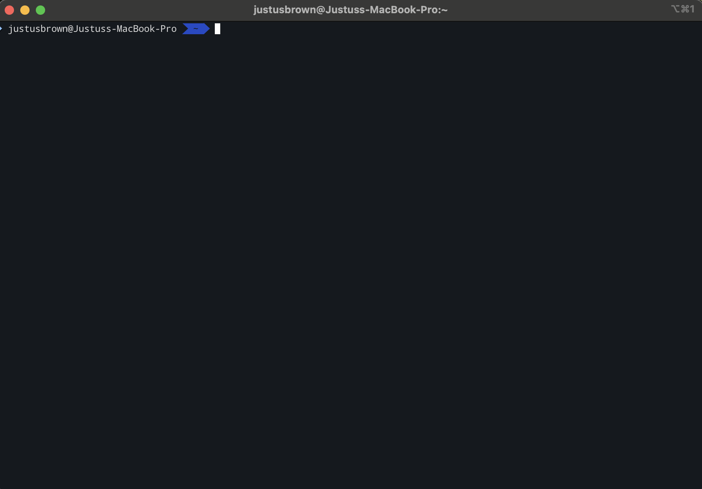
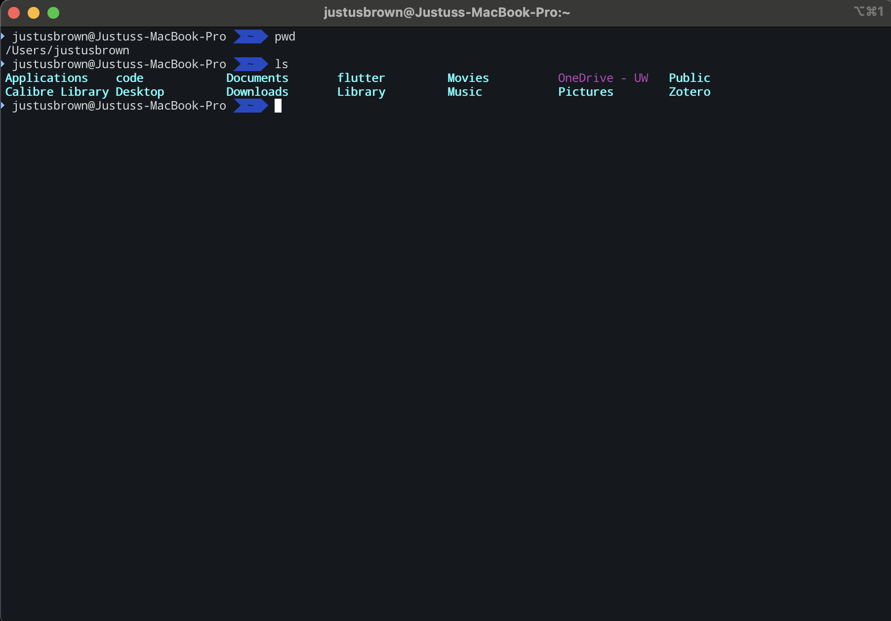
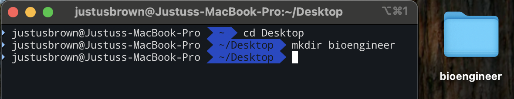
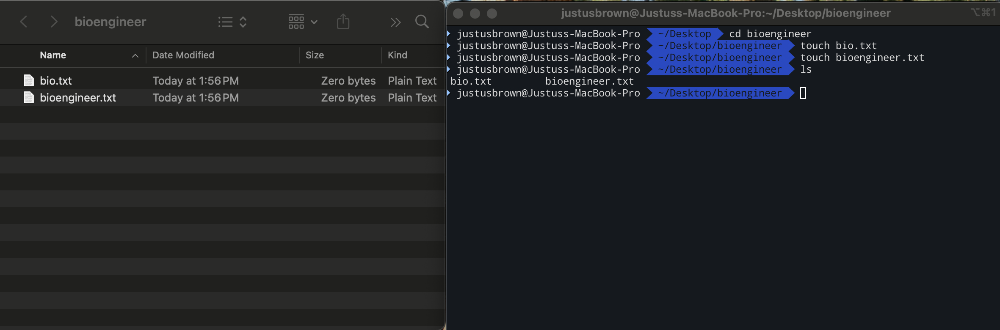

# Exercise 1
In this exercise, you will learn how to navigate the command line, create and manage directories and files, and use basic commands. This will help you become familiar with the command line interface and prepare you for more advanced exercises in this course.

## Table of Contents
- [Learning Objectives](#learning-objectives)
- [Prerequisites](#prerequisites)
- [Getting Started](#getting-started)
- [Orienting Yourself in the Command Line](#orienting-yourself-in-the-command-line)
- [Computer File System Structure](#computer-file-system-structure)
- [Creating and Managing Directories and Files](#creating-and-managing-directories-and-files)
    - [Creating Directories](#creating-directories)
    - [Creating Files](#creating-files)
    - [Viewing File Contents](#viewing-file-contents)
    - [Deleting Files and Directories](#deleting-files-and-directories)
- [Summary](#summary)

## Learning Objectives
By the end of this exercise, you will be able to:
1. Navigate the command line interface.
2. Create and manage directories and files.
3. Use basic commands like `pwd`, `ls`, `cd`, `mkdir`, `touch`, `cat`, `echo`, and `rm`.
4. Understand the file system structure of your computer.
5. Delete files and directories using the command line.

## Prerequisites
Before starting this exercise, make sure you have the following tools installed:
- [Git](https://git-scm.com/downloads) (includes Git Bash for Windows users)
    - **Windows users:** Download Git for Windows, which includes [Git Bash](https://git-scm.com/downloads/win), a terminal emulator that provides a Unix-like command line experience. This will create a more consistent experience across platforms during this exercise.
    - **Mac users:** Install [Homebrew](https://brew.sh/). Homebrew is a package manager for macOS that allows you to easily install and manage software packages like Python and even [Visual Studio Code](https://formulae.brew.sh/cask/visual-studio-code). 
- [Visual Studio Code](https://code.visualstudio.com/download) (or any text editor of your choice)

## Getting Started

**Note:** Throughout this exercise, please type the commands rather than copy-pasting them, as this will help you learn the commands better.

1. To get started with the command line, you will need to open a terminal or command prompt:
    - **Mac:** Open the Terminal application (found in Applications > Utilities)
    - **Windows:** Open Git Bash (if you installed Git) or Command Prompt (cmd)

2. Your terminal should now be open and ready for you to type commands. You will see a prompt that looks something like this:
    ```bash
    username@hostname:~$
    ```
    This indicates that you are in your home directory.



## Orienting Yourself in the Command Line

Whenever I start using the command line, I like to start by asking the following questions: **Where am I?** and **What's in here?**

### 1. "Where am I?"

```bash
pwd
```

`pwd` stands for "Print Working Directory" and will display the full path to the directory (folder) you are currently in.

### 2. "What's in here?"

```bash
ls
```

The `ls` command stands for "List" and will display all the files and subdirectories in your current directory.



## Computer File System Structure

The file system of your computer is organized in a hierarchical structure, similar to a tree. At the top of this hierarchy is the **root directory**, which contains all other directories and files.

- **Linux and Mac:** The root directory is represented by a forward slash `/`
- **Windows:** The root directory is represented by a drive letter followed by a colon and backslash (e.g., `C:\`)


*File tree structure diagram (Image by Peter Flass - Own work, CC BY-SA 4.0)*

### Exploring the Root Directory

1. Navigate to the root directory of your computer using `cd`:
   ```bash
   cd /
   ```

2. Use the `ls` command to list the contents of the root directory:
   ```bash
   ls
   ```
   
   You will most likely see directories like `home`, `usr`, `bin`, etc. The root directory is the top-level directory of your file system, and you will not often need to navigate here directly.

3. Navigate back to your home directory using `cd`:
   ```bash
   cd ~
   ```
   
   Alternatively, you could use `cd /home/yourusername` (replace `yourusername` with your actual username).

## Creating and Managing Directories and Files

Now that you know how to navigate the file system, let's practice creating and managing directories and files.

### Setting Up Your Workspace

1. Open your terminal or Git Bash
2. Use the `pwd` command to confirm you are in your home directory
3. Use the `ls` command to list the contents of your home directory. You should see directories like `Documents`, `Downloads`, `Desktop`, etc.
4. Navigate to your Desktop directory:
   ```bash
   cd Desktop
   ```

### Creating Directories

5. Create a new directory called `bioengineer`:
   ```bash
   mkdir bioengineer
   ```



6. Use the `ls` command to confirm that the `bioengineer` directory was created successfully. You should see `bioengineer` listed in the output.

7. Navigate into the `bioengineer` directory:
   ```bash
   cd bioengineer
   ```

### Creating Files

8. Inside the `bioengineer` directory, create a new file called `bio.txt`:
   ```bash
   touch bio.txt
   ```

9. Create a second file called `bioengineer.txt`:
   ```bash
   touch bioengineer.txt
   ```

10. Use the `ls` command to confirm that both files were created successfully:
    ```bash
    ls
    ```



11. You can also use the `ls -l` command to see more details about the files, such as their size and modification date:
    ```bash
    ls -l
    ```

> **Screenshot placeholder:** Output of `ls -l` command

12. **Verification step:** Check that the files were created by looking in the `bioengineer` directory using your file explorer/Finder.

### Viewing File Contents

13. Use the `cat` command to display the contents of the `bio.txt` file:
    ```bash
    cat bio.txt
    ```
    
    **Note:** Since the file is currently empty, you will not see any output.

14. Use the `echo` command to add some text to the `bio.txt` file:
    ```bash
    echo "Welcome MAB Class of 2026!" > bio.txt
    ```
    
    This command will write the text "Welcome MAB Class of 2026!" into the `bio.txt` file.

15. Use the `cat` command again to display the contents of the `bio.txt` file:
    ```bash
    cat bio.txt
    ```
    
    You should see the text "Welcome MAB Class of 2026!" displayed in the terminal.

> **Screenshot placeholder:** Output of `cat` command showing file contents

### Deleting Files and Directories

16. Use the `rm` command to delete the `bio.txt` file:
    ```bash
    rm bio.txt
    ```

17. Use the `ls` command to confirm that the file has been deleted successfully. You should no longer see `bio.txt` listed in the output.

18. Navigate back out of the `bioengineer` directory:
    ```bash
    cd ..
    ```

19. Try running the `rm` command to remove the `bioengineer` directory:
    ```bash
    rm bioengineer
    ```
    
    You will get an error message saying that the directory is not empty. This is because the directory contains the `bioengineer.txt` file.

> **Screenshot placeholder:** Error message from attempting to remove non-empty directory

20. To remove the directory, you need to use the `rm -r` command, which stands for "remove recursively." This command will delete the directory and all of its contents:
    
    ⚠️ **Warning:** Be careful with this command, as it will permanently delete everything in the directory without confirmation.
    
    ```bash
    rm -r bioengineer
    ```

21. Use the `ls` command to confirm that the `bioengineer` directory has been deleted successfully. You should no longer see `bioengineer` listed in the output.

22. **Verification step:** Confirm the directory was deleted by checking your file explorer/Finder. You should no longer see the `bioengineer` directory.

> **Screenshot placeholder:** Desktop after directory deletion

## Summary

In this exercise, you learned how to navigate the file system using the command line, create and manage directories and files, and use basic commands including:

- `pwd` - Print working directory
- `ls` - List directory contents
- `cd` - Change directory
- `mkdir` - Create directories
- `touch` - Create files
- `cat` - Display file contents
- `echo` - Output text (and redirect to files)
- `rm` - Remove files and directories

You also learned how to delete files and directories using the `rm` command and the importance of using `rm -r` for directories. These fundamental skills are essential for working with the command line and will serve as the foundation for future exercises in this course.

### Key Takeaways

- Always be aware of your current directory location (`pwd`)
- Use `ls` to explore directory contents before making changes
- The `touch` command creates empty files
- Be cautious with `rm -r` as it permanently deletes directories and their contents
- Practice typing commands rather than copying to build muscle memory